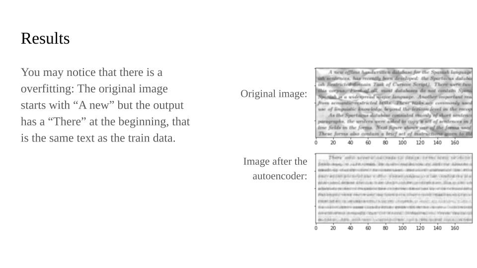
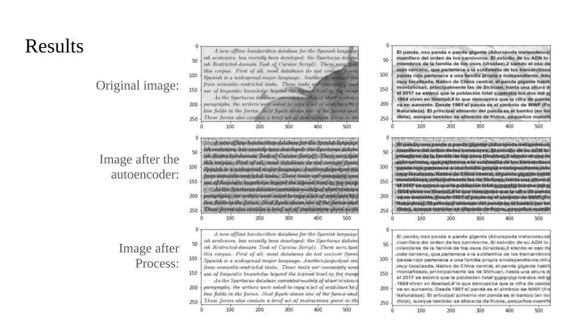
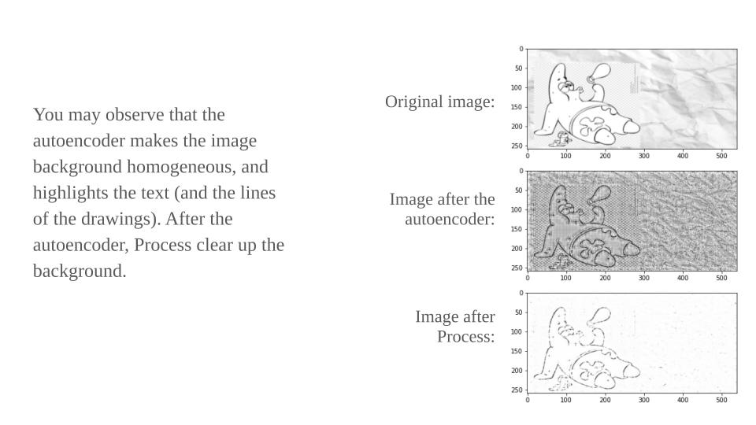
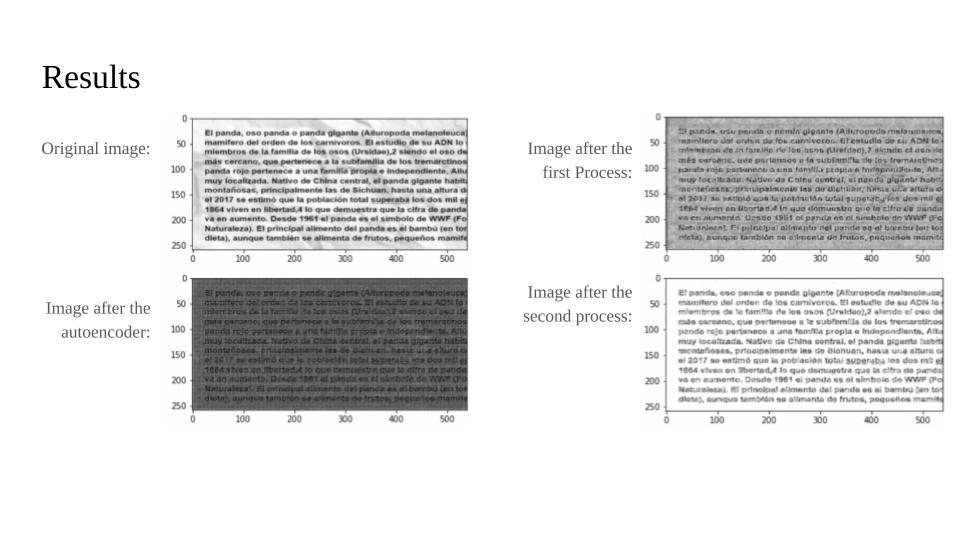
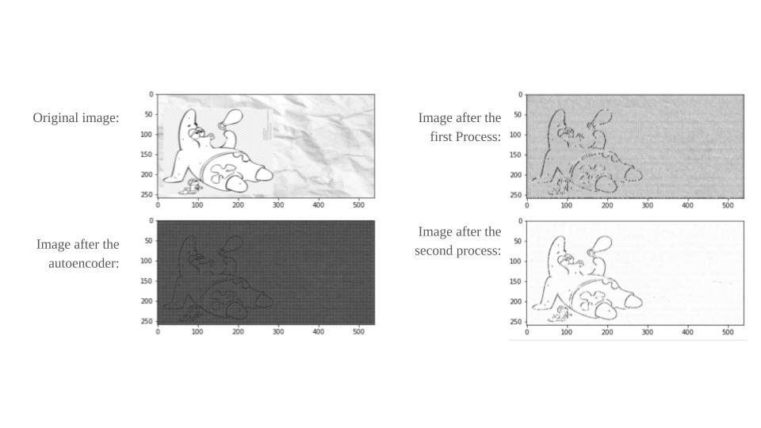
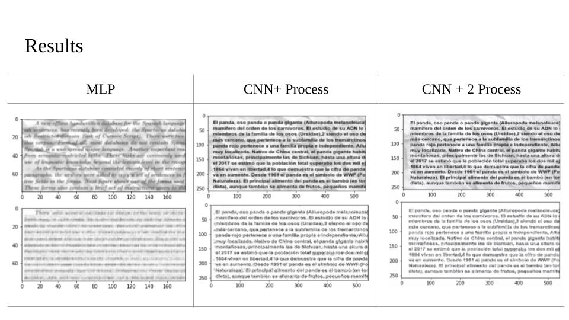
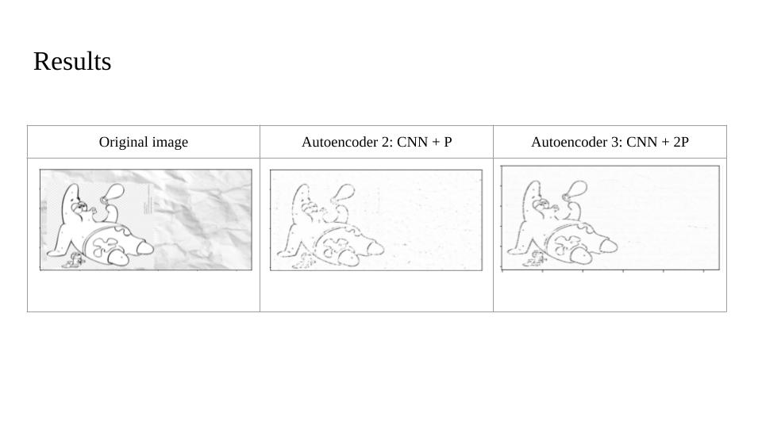

## DENOISING AUTOENCODER
Denoised text images (and black and white drawings) using three different types of architecture MLP and CNN based:
1. MLP Autoencoder
2. CNN Auntoencoder + post CNN process 
3. CNN Auntoencoder + 2 post CNN process

#### Architecture 1: MLP

#### Architecture 2: CNN + process

#### Architecture 2: CNN + 2 process

#### Results comparison

More detail in Denoising_autoencoder_ENG.pdf